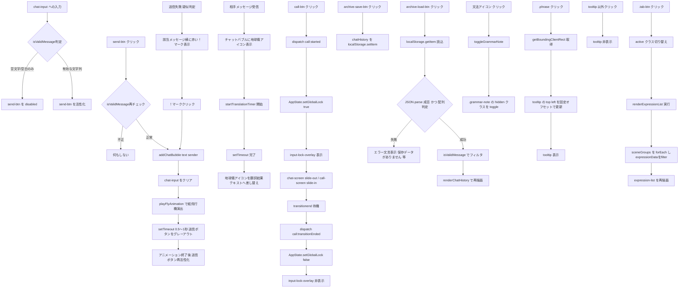

# [AI翻訳チャット＋通話アプリ（仮）] JavaScriptロジック品質・セキュリティ強化型詳細設計書

---

## 1. フロントエンドJavaScript開発基本方針

- **実装モデル：** 西野くん（デザイン担当）のHTML/CSSモックアップに対し、Vanilla JS（生JavaScript、ES Modules）でイベント制御・擬似挙動（翻訳／通話／アーカイブ等）を組み込むモデル。バンドラは導入せず、ブラウザネイティブの`import/export`のみで完結させる。
- **主要UIフレームワーク：** Tailwind CSS。状態の見た目反映は`classList.add/remove/toggle`によるクラスの着脱で行い、インラインstyleの直接操作は座標計算が必須な箇所（ツールチップ位置決め等）のみに限定する。
- **読み込み制御ルール：**
  - `index.html`からは`main.js`のみを`<script type="module" src="./js/main.js" defer></script>`として読み込む。
  - `type="module"`はデフォルトで遅延実行されるため`defer`と実質的に等価だが、意図を明示する目的で両方指定する。
  - 他モジュール（chat.js、call.js等）は`main.js`側の`import`文経由でのみ読み込み、HTMLから直接`<script>`タグを増やさない。
- **命名規則：**
  - 関数名・変数名：キャメルケース（例：`sendMessage`、`isValidMessage`、`chatHistory`）
  - 状態フラグ：`is`＋形容詞（例：`isSending`、`isLocked`、`isAnimating`、`isTransitioning`）
  - 主要HTML要素ID：ケバブケース＋役割名（例：`send-btn`、`call-btn`、`chat-area`、`chat-input`、`input-lock-overlay`、`tooltip`、`archive-save-btn`、`archive-load-btn`、`expression-list`）
  - クラス名：役割ベース（例：`.chat-bubble`、`.grammar-note`、`.phrase`、`.tab-btn`）

---

## 2. JavaScript変数・データ設計

### ① 管理するアプリケーション状態（State）一覧

| 状態名 | 型 | 管理場所 | 役割 |
|---|---|---|---|
| `state.chat.isSending` | Boolean | AppState（app-state.js） | 送信ボタンの連打防止用フラグ |
| `state.chat.isLocked` | Boolean | AppState | チャット入力全体のロック状態 |
| `state.call.isAnimating` | Boolean | AppState | 通話画面遷移アニメーション中フラグ |
| `state.call.isLocked` | Boolean | AppState | 通話中の操作ロック状態 |
| `state.call.elapsedSeconds` | Number | AppState | 通話経過秒数（`setCallElapsed`で更新） |
| `state.translation.isRendering` | Boolean | AppState | 翻訳処理が1件以上進行中かの集約フラグ |
| `state.ui.isTransitioning` | Boolean | AppState | 画面遷移中の全体オーバーレイロック用フラグ（唯一の真実源） |
| `chatHistory` | Array\<Object\> | archive.js | 送受信メッセージの履歴（アーカイブ保存対象） |
| `timerRegistry` | WeakMap\<Element, Number\> | translation.js | バブル要素→翻訳タイマーID（弱参照でGC可能） |
| `activeBubbles` | Set\<Element\> | translation.js | 現在アクティブな翻訳待ちバブルの索引（一括操作用） |
| `callIntervalId` | Number \| null | call.js | 通話経過タイマーのID（単一値のため通常変数管理） |
| `callAbortController` | AbortController \| null | call.js | 通話開始時に生成し、終了時に紐づく全タイマーを一括中断 |
| `phraseMap` | Object\<string, {id, explanation}\> | phrase-visualizer.js | ハイライト対象フレーズと解説文の対応表 |
| `expressionData` | Array\<Object\> | expression-list.js | 表現の「型」一覧の元データ（軸ごとの属性を持つ） |
| `sceneGroups` | Array\<Object\> | expression-list.js | 選択中の軸に応じた固定グルーピング定義（見出し＋絞り込み値） |

> **設計原則：** `state`オブジェクトの生データはモジュール内に完全に隠蔽し、外部からは`AppState.getState()`（`structuredClone`によるスナップショット）と各`setXxx`系メソッド経由でのみアクセス可能とする（プロパティ直接代入は禁止）。

### ② 擬似チャット返信データ定義（モック用のデータ構造）

相手（AI）側からの擬似返信は、英語原文・日本語訳・文法解説・フレーズ対応をひとつのオブジェクトにまとめて配列管理する。

```javascript
// mock-data.js（想定構造）
const mockReplies = [
  {
    id: "m001",
    en: "Could you tell me more about that?",
    ja: "それについてもっと教えていただけますか？",
    grammarNote: "「Could you ~?」は依頼を丁寧に行う定番表現。「Can you ~?」より柔らかい印象になる。",
  },
  {
    id: "m002",
    en: "I really appreciate your help with this.",
    ja: "これについて手伝ってくれて本当に感謝しています。",
    grammarNote: "「appreciate」は他動詞で、直後に感謝の対象（名詞・動名詞）を直接置く点に注意。",
  },
  // ...以降、開発期間内で必要件数を追加
];

// フレーズハイライト用の対応表（単純一致検索の対象）
const phraseMap = {
  "Could you": { id: "p001", explanation: "丁寧な依頼を切り出す定型フレーズ。" },
  "I really appreciate": { id: "p002", explanation: "強い感謝を伝える定型フレーズ。" },
};
```

- `mockReplies`は`sendMessage()`実行後、`setTimeout`による疑似遅延を経て`ja`テキストへ差し替える翻訳モックの元データとして使用する。
- `phraseMap`のキー文字列は、`translation.js`が差し替え済みの`ja`テキストではなく**元の`en`テキスト側**、または要件に応じて`ja`側の対応表として、フェーズごとに参照方向を統一する（実装フェーズで一箇所に確定させる）。

---

## 3. JavaScriptイベント制御・フロー設計

### ① イベントリスナー・関数設計（Mermaid表記）



**補足テーブル（Mermaidが正しく表示されない場合用）：**

| トリガー操作 | 実行される関数 | 変化するHTML要素 |
|---|---|---|
| `chat-input`への入力 | 無名リスナー（`isValidMessage`判定） | `send-btn`の`disabled`属性 |
| `send-btn`クリック / Enterキー | `sendMessage()` → `addChatBubble()` → `playFlyAnimation()` | `chat-area`内に`.chat-bubble`追加、`chat-input`クリア、`send-btn`一時グレーアウト |
| 相手メッセージ受信 | `startTranslationTimer()` | 該当`.chat-bubble`内の地球儀アイコン→翻訳結果テキスト |
| `call-btn`クリック | `startCall()` → `transitionToCallScreen()` | `chat-screen`/`call-screen`のスライド、`input-lock-overlay`の表示切替 |
| 送信失敗（疑似判定） | エラー表示処理 → 再クリックで`sendMessage()`再実行 | 該当バブル横に「！」マーク追加/削除 |
| `archive-save-btn`クリック | `saveArchive()` | なし（`localStorage`書き込みのみ） |
| `archive-load-btn`クリック | `loadArchive()` | `chat-area`の再描画、または注意文言表示 |
| 文法アイコンクリック | `toggleGrammarNote()` | `.grammar-note`の`hidden`クラス |
| `.phrase`クリック | 無名リスナー | `#tooltip`の位置・表示 |
| `.tab-btn`クリック | `renderExpressionList()` | `#expression-list`の中身、`.tab-btn`の`active`クラス |

> **重要方針：** 動的に追加する`.chat-bubble`・`.grammar-note`・`.phrase`等のタグ構造（クラス名・ネスト階層）は、西野くんのHTML設計と**厳密に一致**させる。実装フェーズ開始前にHTML側のマークアップサンプルを一度すり合わせる。

### ② 状態遷移図（Mermaid表記）

```mermaid
flowchart LR
  S1[通常チャット状態] -- call-btn クリック --> S2[画面遷移アニメーション中]
  S2 -- transitionend 検知 --> S3[通話モック中状態]
  S3 -- 通話終了操作 --> S4[画面遷移アニメーション中 逆方向]
  S4 -- transitionend 検知 --> S1

  S2 -. AppState.setGlobalLock true .-> S2
  S4 -. AppState.setGlobalLock true .-> S4
  S1 -. ロック解除済み .-> S1
  S3 -. call:started 発火でタイマー開始 startCallTimer .-> S3
  S4 -. call:ended 発火でタイマー停止 stopCallTimer clearInterval .-> S1
```

**補足テーブル：**

| 状態 | 全体ロック（`isTransitioning`） | 通話経過タイマー | 遷移トリガー |
|---|---|---|---|
| 通常チャット状態 | false | 停止中 | `call-btn`クリックで遷移開始 |
| 画面遷移アニメーション中（往路） | true | 未開始 | `transitionend`検知で次状態へ |
| 通話モック中状態 | false | 稼働中（`setInterval`1秒毎） | 通話終了操作で遷移開始 |
| 画面遷移アニメーション中（復路） | true | `call:ended`発火時点で`clearInterval`停止済み | `transitionend`検知で通常状態へ復帰 |

---

## 4. ディレクトリ・ファイル構成（VSCode対応）

```
[各自のフォルダ名]/
├── index.html                 … 全体マークアップ、input-lock-overlay・tooltip等の共有要素を含む
├── css/
│   └── style.css              … Tailwind補完用のカスタムCSS（スライド・回転アニメーションのキーフレーム等）
├── js/
│   ├── app-state.js           … グローバル状態ストア（AppState）。setXxx系メソッドのみ公開
│   ├── validation.js          … isValidMessage() 等の共通バリデーション関数
│   ├── chat.js                … 送信ボタン制御・addChatBubble・sendMessage（XSS対策のtextContent構築含む）
│   ├── animation.js           … 紙飛行機アニメーション・画面遷移スライド・lockUI/unlockUI
│   ├── call.js                … 通話モック開始/終了・経過タイマー（setInterval/clearInterval）
│   ├── translation.js         … 地球儀アイコン制御・翻訳疑似処理（WeakMap/Set/AbortController管理）
│   ├── archive.js             … localStorage保存/読込・構造検証・安全なエラー文言表示
│   ├── grammar.js             … 文法解説エリアの開閉（toggleGrammarNote）
│   ├── phrase-visualizer.js   … フレーズハイライト（DocumentFragment構築）・ツールチップ表示
│   ├── expression-list.js     … タブ切り替え・固定グルーピングによる表現一覧描画
│   ├── mock-data.js           … mockReplies・phraseMap・expressionData・sceneGroups 等のモックデータ定義
│   └── main.js                … 各モジュールのimport・初期化・イベントリスナー登録の起点（唯一HTMLから読み込む）
└── assets/
    ├── icons/                 … 紙飛行機・地球儀SVG等（西野くん提供素材）
    └── mock/                  … 通話中画面モック用の静止画像等（必要な場合）
```

- HTMLから直接読み込むJSファイルは`js/main.js`の1本のみ。それ以外は`import`文で連結し、グローバルスコープの汚染を防ぐ。
- 各ファイルの「公開インターフェース」と「非公開スコープ」は明確に分離し、モジュール外から内部変数（`state`本体、`timerRegistry`等）へ直接アクセスできないようにする。

---

## 5. JavaScript品質・セキュリティ仕様の設計（★成果まとめ）

- **フロントエンド堅牢性ポリシー：**
  - XSS対策として、ユーザー由来・外部由来（`phraseMap`の解説文含む）の文字列をDOMへ挿入する際は**`innerHTML`を一切使用せず**、`textContent`または`document.createTextNode`、`DocumentFragment`による安全な部分構築で統一する。
  - 入力値バリデーションは`isValidMessage()`（`typeof`チェック＋`trim().length > 0`）に一元化し、①送信ボタンの活性制御、②`sendMessage()`内ガード、③`localStorage`読込時のフィルタリング、④描画関数（`addChatBubble`）自体の最終防衛ラインの**4箇所すべて**で同一関数を再利用する（多層防御）。
  - `localStorage`から読み込んだデータは`try...catch`によるJSON構文チェックと`Array.isArray`による構造チェックを必ず経由し、不正データはエラーで処理を止めず「保存データがありません／形式が不正です」等の安全な文言表示に置き換える。フィルタ後データの自動書き戻しは行わない（要件のスコープアウト事項順守）。

- **イベントバグおよびリソース保護設計：**
  - 連打防止は「透明オーバーレイ（`input-lock-overlay`）による物理的なクリック吸収」を主軸とし、`z-index`レイヤー設計により`call-btn`のみを例外的に押下可能にする。加えてEnterキー送信等のキーボード迂回経路にも`AppState.getState().ui.isTransitioning`チェックを個別に設ける二段ガードとする。
  - 送信ボタンおよび翻訳処理は`disabled`属性・グレーアウトクラスによる二重押下防止を行い、`setTimeout`（0.5〜1秒）経過後にのみ再活性化する。
  - タイマー管理は用途によって手法を使い分ける：通話経過表示（単一の`setInterval`）は通常変数`callIntervalId`で管理し、通話終了時に`clearInterval`で確実に停止する。個別バブルの翻訳タイマー（複数同時発生しうる`setTimeout`）は`WeakMap`（要素参照によるメモリリーク防止）＋`Set`（一括反復・クリア用索引）で管理し、`AbortController`による一括中断と`abort`イベントでの`clearTimeout`橋渡しを徹底する（`AbortSignal`は`setTimeout`にネイティブ対応しないため）。
  - `<script type="module" defer>`によるロード制御を徹底し、DOM構築前のスクリプト実行によるエラーを防止する。
  - `AppState`への書き込みは`setXxx`系メソッド経由のみに限定し、`CustomEvent`のリスナー内では状態を直接書き換えず`AppState`のメソッド呼び出しに徹する（責務分離：イベント＝通知、状態変更＝AppStateのメソッド）。
